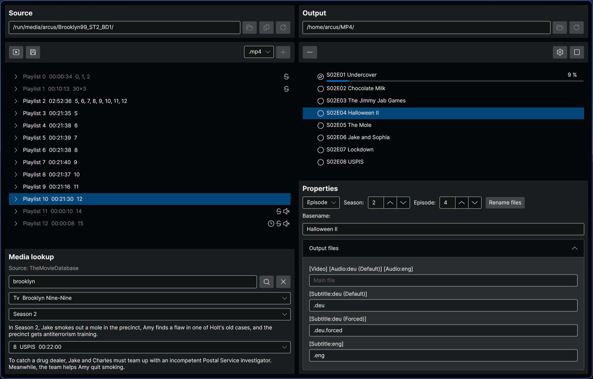

# MediaRipper

This is a graphical interface to archive movies and TV shows from Blu-ray discs. It simplifies the ripping process for 
movies and TV shows while also organizes the output for media services like 
[Jellyfin](https://github.com/jellyfin/jellyfin).

## Performance and speed

Manual ripping is done in two phases: Exporting a title using [MakeMKV](https://www.makemkv.com/) to `mkv` and 
transcoding the file into a smaller, streamable codec. Blu-ray subtitle must eigther be dropped or backed into the video 
feed, because embedded PGS subtitles are not supported by web-based players.

The MediaRipper can directly transcode from the source disc, skipping the requirement of storing the raw export on your
hard drive and starting directly with the transcoding process. PGS subtitles are stored as separat files next to the 
video file. These will automatically be used by Jellyfin if experimental PGS subtitles are enabled in the playback 
settings.

## Organization

This tool can use a personal api key from [TheMovieDatabase](https://www.themoviedb.org/) to automatically name the
output files.

The source list will highlight important playlists. A playlist is flagged as unimportant if:
- The duration is shorter than 10 seconds.
- The duration is longer than 5 hours _(looping menus)_.
- The playlist has no audio.
- The playlist has no subtitles _(all main titles and extras should have subtitles)_.
- The playlist is a duplicate.
- The playlist has repeating segments _(most likely menus)_.

An additional JSON file is added to the output directory containing the disc and export information. The idea is to 
share the title information and categorization to an online repository like [TheDiscDb](https://thediscdb.com/) in the 
future.

# Requirements

- [MakeMKV](https://www.makemkv.com/) - `libmmbd` is used to decrypt Blu-ray discs. A MakeMKV license must be activated.
- [FFmpeg](https://ffmpeg.org/) - `ffmpeg` is used for transcoding. `ffplay` is used to preview segments.
- [.NET 10 SDK](https://dotnet.microsoft.com/download) - For development and compiling.

# Usage

## Exporting a TV show

- Click "Open source" and select your disc drive.
- Click "Open output" and select a target directory on your hard drive.
- Search the TV show in the media lookup and select the first episode on the current disc.
- Select the playlist that matches the first episode.
- Click the "+" button.
  - The file is queued with the episode number and title.
  - The media lookup will automatically advance one episode.
- Repeat this for all episodes on the disc.
- Clear the media lookup and queue all extra playlist.
- You can categorize and rename the extras manually.
- Click the play button to start the export process.

# Ideas for the future

- Add custom codec settings.
- Implement proper DVD support.
- Sync titles with [TheDiscDb](https://thediscdb.com/).